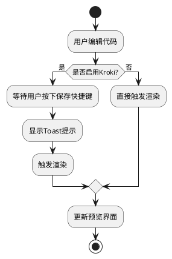
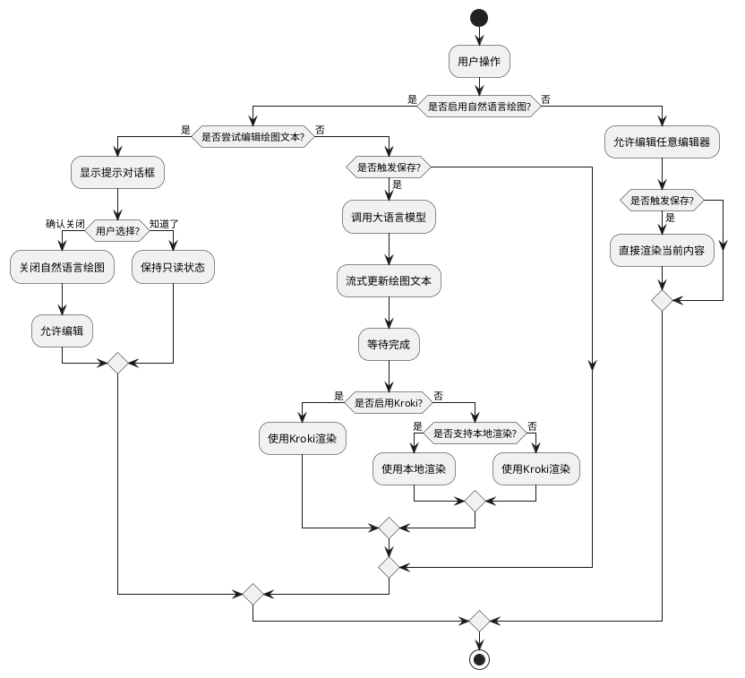

# LangDraw 在线绘图工具 - 需求与技术方案文档

## 目录
1. [功能需求](#功能需求)
2. [技术方案](#技术方案)
   - [已实现功能](#已实现功能)
     - [快捷键保存与渲染优化](#快捷键保存与渲染优化)
     - [界面优化与自然语言绘图增强](#界面优化与自然语言绘图增强)
   - [待实现功能](#待实现功能)

## 功能需求

### 1. 快捷键保存与渲染优化

#### 1.1 需求描述
- **问题背景**：在使用 Kroki 渲染时，每次编辑器内容变化都会触发渲染请求，造成不必要的服务器负载
- **目标**：优化渲染触发机制，提升用户体验和系统性能
- **具体需求**：
  1. 当开启 Kroki 渲染时，编辑器内容变化不应立即触发渲染
  2. 通过快捷键（Mac: Command+S, Windows: Ctrl+S）触发保存和渲染
  3. 渲染时显示 toast 提示，告知用户保存和渲染状态
  4. 关闭 Kroki 渲染时保持原有的实时渲染行为
- **提示词**：为应用添加保存快捷键功能（Ctrl+S/Cmd+S），优化Kroki渲染的触发机制，添加Toast提示，只在用户主动保存时才触发Kroki渲染

#### 1.2 验收标准
1. 开启 Kroki 渲染时：
   - 编辑内容不会触发自动渲染
   - 使用快捷键可以触发渲染
   - 触发渲染时显示 toast 提示
2. 关闭 Kroki 渲染时：
   - 保持实时渲染功能
   - 编辑内容自动触发渲染更新

### 2. 界面优化与自然语言绘图增强

#### 2.1 需求描述
- **问题背景**：需要优化工具栏布局和编辑器交互，提升自然语言绘图功能的用户体验
- **目标**：简化操作流程，优化用户交互体验
- **具体需求**：
  1. 工具栏优化：
     - 将"启用自然语言绘图"选项从设置弹窗移至工具栏
     - 将刷新图标改为保存图标，实现与快捷键保存相同的功能
  2. 双编辑器支持：
     - 提供自然语言编辑器和绘图文本编辑器
     - 添加编辑器切换按钮
     - 两种编辑器始终保持切换功能，无论是否启用自然语言绘图
  3. 自然语言绘图流程优化：
     - 仅在用户保存时（快捷键或按钮）触发大语言模型调用
     - 流式获取绘图文本并实时更新到绘图文本编辑器
     - 全部内容获取完成后自动渲染
  4. 渲染优先级：
     - 优先使用 Kroki（如果开启）
     - 其次检查本地渲染支持（目前仅 Mermaid）
     - 默认使用 Kroki 渲染
  5. 编辑器权限控制：
     - 启用自然语言绘图时，绘图文本编辑器为只读
     - 用户尝试编辑时弹出提示对话框
     - 提供"确认关闭"和"知道了"两个选项
     - "确认关闭"会关闭自然语言绘图模式
     - "知道了"保持当前状态不变
- **提示词**：修改index.html文件，添加自然语言绘图选项和保存按钮到工具栏，实现双编辑器支持，在自然语言绘图模式下锁定图表编辑器，流式更新绘图文本编辑器内容

#### 2.2 验收标准
1. 工具栏改动：
   - 自然语言绘图开关直接显示在工具栏
   - 保存按钮功能正常，提示正确
2. 编辑器功能：
   - 两个编辑器可以正常切换
   - 内容保持同步
   - 切换按钮位置合理，图标清晰
3. 自然语言绘图模式：
   - 保存时正确调用大语言模型
   - 流式响应正确更新到编辑器
   - 完成后自动渲染生效
4. 权限控制：
   - 启用自然语言绘图时绘图文本编辑器确实只读
   - 尝试编辑时弹出提示对话框
   - 两个按钮功能符合预期

### 3. 编辑器标识与模态框优化

#### 3.1 需求描述
- **问题背景**：用户需要明确知道当前使用的是哪种编辑器，并修复一些模态框自动弹出的问题
- **目标**：优化用户界面体验，减少困惑和干扰
- **具体需求**：
  1. 编辑器类型标识：
     - 在编辑器面板标题中清晰显示当前编辑器类型（"图表编辑器"或"自然语言编辑器"）
     - 为不同编辑器类型添加差异化的图标提示
     - 切换编辑器时更新标题和图标
  2. 模态框显示优化：
     - 修复初次加载页面时设置框自动弹出的问题
     - 修复自然语言绘图模式下自动弹出提示对话框的问题
     - 确保对话框只在用户明确操作时弹出
- **提示词**：CSS中的:contains()选择器不是标准选择器，可能不被所有浏览器支持，请修改为使用类名选择器，并优化编辑器标题显示和模态框行为

#### 3.2 验收标准
1. 编辑器标识：
   - 编辑器面板显示当前正在使用的编辑器类型名称
   - 不同编辑器有独特的图标区分
   - 切换编辑器时，标题和图标自动更新
2. 模态框优化：
   - 页面首次加载时不会自动弹出任何对话框
   - 对话框的显示和隐藏有平滑的过渡效果
   - 确保多个对话框不会同时显示

#### 3.3 实现方案
1. **编辑器标识实现**
```html
<!-- 编辑器面板标题结构 -->
<div class="panel-header">
    <span class="diagram-editor">图表编辑器</span>
    <button id="editor-switch" class="editor-switch" title="切换到自然语言编辑器">
        <i class="fas fa-exchange-alt"></i> 切换到自然语言
    </button>
</div>
```

```css
/* 面板标题样式 */
.panel-header span {
    font-size: 16px;
    display: flex;
    align-items: center;
}

/* 编辑器标识图标 */
.panel-header span::before {
    margin-right: 8px;
    font-family: 'Font Awesome 5 Free';
    font-weight: 900;
}

/* 图表编辑器标识 */
.panel-header span.diagram-editor::before {
    content: '\f1c9';  /* 代码文件图标 */
    color: #4fc3f7;
}

/* 自然语言编辑器标识 */
.panel-header span.nl-editor::before {
    content: '\f27a';  /* 聊天气泡图标 */
    color: #81c784;
}
```

```javascript
// 切换编辑器时更新标题
function toggleEditor() {
    const editorPanelHeader = document.querySelector('.editor-panel .panel-header');
    
    if (currentEditor === 'diagram') {
        // 切换到自然语言编辑器
        editorPanelHeader.innerHTML = `
            <span class="nl-editor">自然语言编辑器</span>
            <button id="editor-switch" class="editor-switch" title="切换到图表编辑器">
                <i class="fas fa-exchange-alt"></i> 返回图表编辑
            </button>
        `;
    } else {
        // 切换到图表编辑器
        editorPanelHeader.innerHTML = `
            <span class="diagram-editor">图表编辑器</span>
            <button id="editor-switch" class="editor-switch" title="切换到自然语言编辑器">
                <i class="fas fa-exchange-alt"></i> 切换到自然语言
            </button>
        `;
    }
    
    // 重新绑定切换按钮事件
    document.getElementById('editor-switch').addEventListener('click', toggleEditor);
}
```

2. **模态框优化实现**
```css
/* 模态对话框样式 */
.modal {
    display: none; /* 默认隐藏 */
    position: fixed;
    top: 0;
    left: 0;
    width: 100%;
    height: 100%;
    background-color: rgba(0, 0, 0, 0.5);
    z-index: 1000;
}

/* 使用单独的类控制显示模态框 */
.modal.show {
    display: flex !important;
    justify-content: center;
    align-items: center;
}
```

```javascript
// 使用类控制模态框显示和隐藏
function showModal(modal) {
    modal.classList.add('show');
}

function hideModal(modal) {
    modal.classList.remove('show');
}

// 初始化处理
document.addEventListener('DOMContentLoaded', function() {
    // 确保所有模态框初始时是隐藏的
    document.querySelectorAll('.modal').forEach(modal => {
        modal.classList.remove('show');
    });
    
    // 如果没有API密钥但启用了自然语言绘图，则静默禁用
    if (settings.enableNLDrawing && !settings.openrouterKey) {
        settings.enableNLDrawing = false;
        localStorage.setItem('enableNLDrawing', 'false');
    }
});
```

#### 3.4 关键设计说明
1. **编辑器标识设计**
   - 使用CSS类控制不同编辑器的图标和样式
   - 在切换编辑器时动态更新DOM元素
   - 通过CSS伪元素添加图标，避免额外的HTML元素

2. **模态框交互优化**
   - 使用CSS类控制模态框的显示和隐藏
   - 添加初始化逻辑防止自动弹出
   - 检查条件避免不必要的模态框显示

3. **用户体验提升**
   - 添加直观的视觉提示
   - 平滑的过渡动画
   - 减少不必要的干扰

#### 3.5 注意事项
1. 确保在DOM更新后重新绑定事件监听器
2. 检查多个对话框之间的交互
3. 确保CSS选择器的浏览器兼容性
4. 初始化顺序很重要，避免初始加载时的闪烁

## 技术方案

### 1. 快捷键保存与渲染优化

#### 1.1 整体流程


#### 1.2 实现方案
1. **Toast组件实现**
```javascript
// 创建toast提示元素
const toast = document.createElement('div');
toast.style.cssText = `
    position: fixed;
    top: 50%;
    left: 50%;
    transform: translate(-50%, -50%);
    background-color: rgba(0, 0, 0, 0.8);
    color: white;
    padding: 12px 24px;
    border-radius: 4px;
    display: none;
    z-index: 1000;
    transition: opacity 0.3s ease-in-out;
    text-align: center;
    min-width: 250px;
    max-width: 80%;
    box-shadow: 0 4px 8px rgba(0, 0, 0, 0.2);
`;
document.body.appendChild(toast);

/**
 * 显示toast提示
 */
function showToast(message, duration = 3000) {
    toast.textContent = message;
    toast.style.display = 'block';
    toast.style.opacity = '1';
    
    setTimeout(() => {
        toast.style.opacity = '0';
        setTimeout(() => {
            toast.style.display = 'none';
        }, 300);
    }, duration);
}
```

2. **快捷键监听实现**
```javascript
// 添加全局快捷键监听
document.addEventListener('keydown', function(e) {
    // 检查是否按下了Command+S (Mac) 或 Ctrl+S (Windows/Linux)
    if ((e.metaKey || e.ctrlKey) && e.key === 's') {
        e.preventDefault(); // 阻止浏览器默认的保存行为
        
        // 获取当前是否使用Kroki
        useKroki = document.getElementById('use-kroki').checked;
        
        if (useKroki) {
            showToast('已保存，开始渲染...');
            renderDiagram(true); // 传入true表示强制渲染
        }
    }
});
```

3. **渲染逻辑优化**
```javascript
// 编辑器变更监听
editor.on('change', function() {
    useKroki = document.getElementById('use-kroki').checked;
    if (!useKroki) {
        // 如果不使用Kroki，则实时渲染
        renderDiagram(false);
    }
});

// 渲染函数优化
async function renderDiagram(forceRender = false) {
    if (renderTimeout) {
        clearTimeout(renderTimeout);
    }

    renderTimeout = setTimeout(async () => {
        const code = editor.getValue();
        const previewContainer = document.getElementById('preview-container');
        useKroki = document.getElementById('use-kroki').checked;

        try {
            if (!useKroki || forceRender) {
                DiagramRenderers.render(code, currentDiagramType, previewContainer);
            }
        } catch (error) {
            console.error('渲染错误:', error);
            DiagramRenderers.showError(`渲染失败: ${error.message}`, previewContainer);
        }
    }, 500);
}
```

#### 1.3 关键设计说明
1. **状态管理**
   - 使用 `useKroki` 变量跟踪 Kroki 渲染状态
   - 通过 `forceRender` 参数控制强制渲染行为

2. **性能优化**
   - 使用防抖处理（500ms）避免频繁渲染
   - 条件渲染避免不必要的 Kroki 服务调用

3. **用户体验**
   - Toast 提示使用渐隐动画效果
   - 保存快捷键符合用户习惯
   - 错误处理和提示完善

#### 1.4 注意事项
1. 确保 toast 提示不会遮挡重要的界面元素
2. 快捷键冲突处理（阻止浏览器默认行为）
3. 错误处理和用户提示完善

### 2. 界面优化与自然语言绘图增强

#### 2.1 整体流程


#### 2.2 实现方案
1. **配置文件更新**
```javascript
// config.js
const config = {
    // ... existing code ...
    
    // 本地渲染支持配置
    localRenderSupport: {
        mermaid: true,
        plantuml: false,
        // ... 其他图表类型
    },
    
    // 编辑器配置
    editor: {
        switchIcon: 'fas fa-exchange-alt',
        saveIcon: 'fas fa-save',
        readOnlyMessage: {
            title: '编辑器已锁定',
            content: '当前处于自然语言绘图模式，绘图文本编辑器为只读状态。是否需要关闭自然语言绘图？',
            confirmText: '确认关闭',
            cancelText: '知道了'
        }
    }
};
```

2. **工具栏改造**
```html
<!-- index.html 工具栏部分 -->
<div class="tools">
    <div class="diagram-type">
        <!-- ... existing code ... -->
    </div>
    <div class="nl-drawing">
        <input type="checkbox" id="enable-nl-drawing" />
        <label for="enable-nl-drawing">启用自然语言绘图</label>
    </div>
    <div class="save">
        <button id="save-btn" class="save-icon" title="保存">
            <i class="fas fa-save"></i>
        </button>
    </div>
    <!-- ... existing code ... -->
</div>
```

3. **编辑器切换实现**
```javascript
// main.js
function initEditors() {
    // 创建两个编辑器实例
    const textArea = document.getElementById('code-editor');
    const nlTextArea = document.createElement('textarea');
    nlTextArea.id = 'nl-editor';
    textArea.parentNode.appendChild(nlTextArea);
    
    // 创建编辑器实例
    diagramEditor = CodeMirror.fromTextArea(textArea, {
        // ... 编辑器配置
    });
    
    nlEditor = CodeMirror.fromTextArea(nlTextArea, {
        // ... 编辑器配置
    });
    
    // 创建切换按钮
    const switchBtn = document.createElement('button');
    switchBtn.className = 'editor-switch';
    switchBtn.innerHTML = `<i class="${config.editor.switchIcon}"></i>`;
    textArea.parentNode.appendChild(switchBtn);
    
    // 初始隐藏自然语言编辑器
    nlEditor.getWrapperElement().style.display = 'none';
    
    // 绑定切换事件
    switchBtn.addEventListener('click', toggleEditor);
}

function toggleEditor() {
    const diagramWrapper = diagramEditor.getWrapperElement();
    const nlWrapper = nlEditor.getWrapperElement();
    
    if (diagramWrapper.style.display !== 'none') {
        diagramWrapper.style.display = 'none';
        nlWrapper.style.display = '';
    } else {
        diagramWrapper.style.display = '';
        nlWrapper.style.display = 'none';
    }
}

// 编辑器权限控制
function setupEditorPermissions() {
    diagramEditor.on('beforeChange', function(cm, change) {
        if (document.getElementById('enable-nl-drawing').checked) {
            showReadOnlyDialog();
            return false; // 阻止编辑
        }
    });
}

function showReadOnlyDialog() {
    const { title, content, confirmText, cancelText } = config.editor.readOnlyMessage;
    
    const dialog = document.createElement('div');
    dialog.className = 'modal';
    dialog.innerHTML = `
        <div class="modal-content">
            <h3>${title}</h3>
            <p>${content}</p>
            <div class="modal-footer">
                <button class="confirm">${confirmText}</button>
                <button class="cancel">${cancelText}</button>
            </div>
        </div>
    `;
    
    document.body.appendChild(dialog);
    
    dialog.querySelector('.confirm').addEventListener('click', () => {
        document.getElementById('enable-nl-drawing').checked = false;
        dialog.remove();
    });
    
    dialog.querySelector('.cancel').addEventListener('click', () => {
        dialog.remove();
    });
}
```

4. **渲染流程优化**
```javascript
async function handleSave() {
    const useNLDrawing = document.getElementById('enable-nl-drawing').checked;
    const useKroki = document.getElementById('use-kroki').checked;
    
    showToast('开始保存...');
    
    if (useNLDrawing) {
        // 获取自然语言内容并去除首尾空格
        const nlContent = nlEditor.getValue().trim();
        
        // 检查自然语言编辑器内容是否为空
        if (!nlContent) {
            showToast('自然语言编辑器内容为空', 3000);
            return;
        }
        
        try {
            // 调用大语言模型API
            const response = await fetch('/api/nl-draw', {
                method: 'POST',
                headers: {
                    'Content-Type': 'application/json'
                },
                body: JSON.stringify({
                    api_key: settings.openrouterKey,
                    user_context: nlContent,
                    draw_tool_name: currentDiagramType,
                    draw_type: document.getElementById('template-select').value || '流程图'
                })
            });
            
            if (!response.ok) {
                throw new Error(`API请求失败: ${response.status} ${response.statusText}`);
            }
            
            // 处理流式响应
            const reader = response.body.getReader();
            let accumulatedCode = '';
            
            while (true) {
                const {value, done} = await reader.read();
                if (done) break;
                
                // 更新绘图文本编辑器
                const chunk = new TextDecoder().decode(value);
                const lines = chunk.split('\n').filter(line => line.trim());
                
                for (const line of lines) {
                    try {
                        const data = JSON.parse(line);
                        
                        if (data.error) {
                            throw new Error(data.error);
                        }
                        
                        accumulatedCode = data.code;
                        diagramEditor.setValue(accumulatedCode);
                        
                        // 如果是最终响应
                        if (data.done) {
                            // 完成后渲染
                            renderDiagram(true);
                            showToast('生成完成');
                        }
                    } catch (error) {
                        console.error('解析响应数据错误:', error);
                        showToast('生成失败: 解析响应数据错误', 3000);
                        return;
                    }
                }
            }
        } catch (error) {
            console.error('自然语言绘图错误:', error);
            showToast('保存失败，请稍后再试: ' + error.message, 3000);
        }
    } else {
        // 直接渲染当前编辑器内容
        renderDiagram(true);
        showToast('保存成功');
    }
}

function renderDiagram(forceRender = false) {
    const code = diagramEditor.getValue();
    const type = document.getElementById('diagram-select').value;
    const useKroki = document.getElementById('use-kroki').checked;
    
    if (useKroki || !config.localRenderSupport[type]) {
        // 使用Kroki渲染
        DiagramRenderers.renderWithKroki(code, type);
    } else {
        // 使用本地渲染
        DiagramRenderers.render(code, type);
    }
}
```

#### 2.3 关键设计说明
1. **编辑器管理**
   - 使用两个独立的 CodeMirror 实例
   - 通过 CSS display 属性控制切换
   - 保持各自的编辑历史和状态

2. **权限控制**
   - 使用 CodeMirror 的 beforeChange 事件拦截编辑
   - 模态对话框提供清晰的用户选择
   - 状态切换即时生效

3. **渲染优化**
   - 配置驱动的渲染决策
   - 流式响应处理
   - 错误处理和提示

4. **用户体验**
   - 清晰的视觉反馈
   - 一致的交互模式
   - 直观的状态提示

#### 2.4 注意事项
1. 确保编辑器切换时不丢失内容
2. 处理好自然语言绘图模式切换时的状态同步
3. 优化流式响应的更新频率，避免过于频繁的重渲染
4. 提供清晰的错误提示和状态反馈
5. 注意模态对话框的层级管理

### 4. 自然语言绘图输入检查与错误处理优化

#### 4.1 需求描述
- **问题背景**：自然语言绘图功能在用户保存时缺乏输入有效性检查和错误处理，导致用户体验不佳
- **目标**：提升自然语言绘图保存流程的健壮性和用户体验
- **具体需求**：
  1. 空内容检查：
     - 启用自然语言绘图时，检查自然语言编辑器内容是否为空
     - 内容为空时不调用API，直接显示提示信息要求用户输入内容
  2. 错误处理增强：
     - 统一处理API请求过程中可能出现的各类错误
     - 针对不同错误类型提供友好的提示信息
     - 包含HTTP错误、解析错误和其他异常情况的处理
- **提示词**：优化自然语言绘图功能，如果用户没有输入内容就提示检查绘图文本，如果API返回错误则显示保存失败的提示，需要进行错误处理优化

#### 4.2 验收标准
1. 空内容处理：
   - 在自然语言编辑器内容为空时点击保存，显示明确的提示信息
   - 不会触发API调用，避免不必要的请求
2. 错误处理：
   - API返回非200状态码时，显示适当的错误信息
   - 响应数据解析错误时，显示相关提示
   - 所有错误提示应清晰明了，指导用户后续操作
3. 用户体验：
   - 错误提示显示足够长的时间（至少3秒）确保用户能够阅读
   - 错误提示应包含简明的错误原因
   - 提示风格与已有toast提示保持一致

#### 4.3 实现方案
```javascript
/**
 * 处理保存操作
 */
async function handleSave() {
    const useNLDrawing = document.getElementById('enable-nl-drawing').checked;
    const useKroki = document.getElementById('use-kroki').checked;
    
    showToast('开始保存...');
    
    if (useNLDrawing) {
        // 获取自然语言内容并去除首尾空格
        const nlContent = nlEditor.getValue().trim();
        
        // 检查自然语言编辑器内容是否为空
        if (!nlContent) {
            showToast('自然语言编辑器内容为空', 3000);
            return;
        }
        
        try {
            // 调用大语言模型API
            const response = await fetch('/api/nl-draw', {
                method: 'POST',
                headers: {
                    'Content-Type': 'application/json'
                },
                body: JSON.stringify({
                    api_key: settings.openrouterKey,
                    user_context: nlContent,
                    draw_tool_name: currentDiagramType,
                    draw_type: document.getElementById('template-select').value || '流程图'
                })
            });
            
            if (!response.ok) {
                throw new Error(`API请求失败: ${response.status} ${response.statusText}`);
            }
            
            // 处理流式响应
            const reader = response.body.getReader();
            let accumulatedCode = '';
            
            while (true) {
                const {value, done} = await reader.read();
                if (done) break;
                
                // 更新绘图文本编辑器
                const chunk = new TextDecoder().decode(value);
                const lines = chunk.split('\n').filter(line => line.trim());
                
                for (const line of lines) {
                    try {
                        const data = JSON.parse(line);
                        
                        if (data.error) {
                            throw new Error(data.error);
                        }
                        
                        accumulatedCode = data.code;
                        diagramEditor.setValue(accumulatedCode);
                        
                        // 如果是最终响应
                        if (data.done) {
                            // 完成后渲染
                            renderDiagram(true);
                            showToast('生成完成');
                        }
                    } catch (error) {
                        console.error('解析响应数据错误:', error);
                        showToast('生成失败: 解析响应数据错误', 3000);
                        return;
                    }
                }
            }
        } catch (error) {
            console.error('自然语言绘图错误:', error);
            showToast('保存失败，请稍后再试: ' + error.message, 3000);
        }
    } else {
        // 直接渲染当前编辑器内容
        renderDiagram(true);
        showToast('保存成功');
    }
}
```

#### 4.4 关键设计说明
1. **输入验证**
   - 使用 `String.trim()` 移除输入内容的首尾空格
   - 在调用API前进行非空检查，避免无效请求
   - 提供明确的用户反馈，指导用户输入内容

2. **错误处理策略**
   - 采用三层错误处理机制：
     1. HTTP响应状态码检查
     2. API返回的错误字段检查
     3. JSON解析错误捕获
   - 为不同错误类型提供具体的错误信息

3. **用户体验优化**
   - 延长错误提示的显示时间（3000ms）
   - 提供清晰的错误来源描述，便于用户理解
   - 统一错误提示格式，保持一致的用户体验

#### 4.5 注意事项
1. 确保错误信息足够明确但不过于技术化
2. 在网络不稳定环境中测试错误处理机制
3. 考虑添加重试机制，提高成功率
4. 保留详细错误日志，便于后期分析和改进

### 5. Toast提示优化

#### 5.1 需求描述
- **问题背景**：当前 Toast 提示显示在页面右下角，不够明显，且不同提示的显示时间不一致
- **目标**：优化 Toast 提示的位置和显示时间，提升用户体验
- **具体需求**：
  1. 位置调整：
     - 将 Toast 提示从右下角移动到页面正中央
     - 确保提示在任何页面状态下都足够醒目
  2. 显示时间统一：
     - 将所有 Toast 提示的默认显示时间统一为 3 秒
     - 确保用户有足够时间阅读提示内容
- **提示词**：toast提示目前在web页面右下角，不明显，需要改到正中间，并且停留时间统一为3s

#### 5.2 验收标准
1. 位置要求：
   - Toast 提示应显示在页面正中央
   - 采用视觉上突出的样式
   - 内容居中对齐
2. 时间控制：
   - 所有 Toast 提示的默认显示时间为 3 秒
   - 提示消失时应有平滑的过渡效果

#### 5.3 实现方案
```javascript
// 创建toast提示元素
const toast = document.createElement('div');
toast.style.cssText = `
    position: fixed;
    top: 50%;
    left: 50%;
    transform: translate(-50%, -50%);
    background-color: rgba(0, 0, 0, 0.8);
    color: white;
    padding: 12px 24px;
    border-radius: 4px;
    display: none;
    z-index: 1000;
    transition: opacity 0.3s ease-in-out;
    text-align: center;
    min-width: 250px;
    max-width: 80%;
    box-shadow: 0 4px 8px rgba(0, 0, 0, 0.2);
`;
document.body.appendChild(toast);

/**
 * 显示toast提示
 */
function showToast(message, duration = 3000) {
    toast.textContent = message;
    toast.style.display = 'block';
    toast.style.opacity = '1';
    
    setTimeout(() => {
        toast.style.opacity = '0';
        setTimeout(() => {
            toast.style.display = 'none';
        }, 300);
    }, duration);
}
```

#### 5.4 关键设计说明
1. **位置设计**
   - 使用 `position: fixed` 确保 Toast 不受页面滚动影响
   - 通过 `top: 50%; left: 50%; transform: translate(-50%, -50%)` 实现完美居中
   - 添加 `min-width` 和 `max-width` 控制显示宽度，适应不同长度的提示内容
   - 增加 `box-shadow` 提高视觉层次感，使提示更加醒目

2. **时间控制**
   - 默认显示时间从 2 秒调整为 3 秒，确保用户有足够时间阅读提示内容
   - 保留 300ms 的渐隐过渡时间，提供平滑的视觉体验

3. **视觉优化**
   - 文本居中对齐，提高可读性
   - 增加内边距，使内容展示更加舒适
   - 半透明黑色背景与白色文字形成强烈对比，提高可读性

#### 5.5 注意事项
1. 确保 Toast 的 z-index 足够高，以避免被其他元素遮挡
2. 对于特别重要的提示信息，可考虑在调用时手动设置更长的显示时间
3. 移动端适配时确保 max-width 的百分比设置能适应各种屏幕尺寸

### 6. 自动渲染功能优化

#### 6.1 需求描述
- **问题背景**：目前系统在普通模式下总是自动渲染图表，而在自然语言绘图模式下需要手动保存触发渲染，用户无法控制普通模式下的渲染行为
- **目标**：提供更灵活的渲染控制选项，让用户可以决定是否使用自动渲染
- **具体需求**：
  1. 自动渲染控制：
     - 添加"启用自动渲染"选项到工具栏
     - 该选项默认开启
     - 用户可以通过勾选框控制是否启用自动渲染
  2. 条件限制：
     - 自动渲染功能仅在非自然语言绘图模式下生效
     - 当启用自然语言绘图时，自动渲染选项应被禁用
  3. 功能逻辑：
     - 启用自动渲染：编辑内容时自动更新预览
     - 禁用自动渲染：仅在用户点击保存按钮或使用保存快捷键时才更新预览
- **提示词**：你需要给工具栏加一个勾选，表示是否开启自动渲染，并且这个自动渲染只在用户没有开启自然语言绘图的时候才生效，如果用户开启了自动渲染，并且没有开启自然语言绘图的模式，那么用户在图标编辑器中编辑的时候，会自动进行渲染，如果用户没有开启自动渲染那么就只有用户手动保存的时候才会渲染

#### 6.2 验收标准
1. 界面要求：
   - 工具栏中有明确的"启用自动渲染"选项
   - 选项默认为勾选状态
   - 在自然语言绘图模式下，该选项呈禁用状态
2. 功能要求：
   - 勾选自动渲染时，编辑器内容变化会触发预览更新
   - 取消勾选时，只有通过保存操作才会更新预览
   - 切换到自然语言绘图模式后，自动渲染功能自动禁用
   - 从自然语言绘图模式切换回来后，自动渲染恢复到用户之前设置的状态
3. 持久化要求：
   - 用户的自动渲染设置应保存到本地存储
   - 刷新页面后保持用户的设置选择

#### 6.3 实现方案
```html
<!-- 工具栏中添加自动渲染选项 -->
<div class="auto-render">
    <input type="checkbox" id="enable-auto-render" checked />
    <label for="enable-auto-render">启用自动渲染</label>
</div>
```

```javascript
// 设置对象中添加自动渲染属性
let settings = {
    openrouterKey: localStorage.getItem('openrouterKey') || '',
    enableNLDrawing: localStorage.getItem('enableNLDrawing') === 'true',
    autoRender: localStorage.getItem('autoRender') !== 'false' // 默认开启自动渲染
};

// 在编辑器内容变化事件中加入自动渲染条件判断
diagramEditor.on('change', function(cm, change) {
    // 仅当用户手动输入（非程序设置值）时进行实时渲染
    if (change.origin !== 'setValue' && change.origin !== 'undo' && change.origin !== 'redo') {
        // 判断是否启用了自动渲染且未启用自然语言绘图
        const shouldAutoRender = settings.autoRender && !settings.enableNLDrawing;
        if (shouldAutoRender) {
            // 实时渲染预览
            renderDiagram(false);
        }
    }
});

// 监听自动渲染开关状态变化
function setupAutoRenderListeners() {
    document.getElementById('enable-auto-render').addEventListener('change', function(e) {
        // 如果是初始加载，忽略事件处理
        if (isInitialLoad) return;
        
        const isEnabled = e.target.checked;
        settings.autoRender = isEnabled;
        localStorage.setItem('autoRender', isEnabled);
        
        // 如果开启了自动渲染，且当前不是自然语言绘图模式，立即触发一次渲染
        if (isEnabled && !settings.enableNLDrawing) {
            renderDiagram(false);
        }
    });
}

// 在自然语言绘图状态变化时更新自动渲染选项状态
function updateEditorsState() {
    const isNLDrawingEnabled = document.getElementById('enable-nl-drawing').checked;
    
    if (isNLDrawingEnabled) {
        // 如果开启了自然语言绘图，自动渲染选项应当被禁用
        document.getElementById('enable-auto-render').disabled = true;
    } else {
        // 如果关闭了自然语言绘图，自动渲染选项应当被启用
        document.getElementById('enable-auto-render').disabled = false;
    }
}
```

```css
/* 工具栏选项样式 */
.nl-drawing, .use-kroki, .auto-render {
    margin-right: 15px;
    display: flex;
    align-items: center;
}

.nl-drawing input, .use-kroki input, .auto-render input {
    margin-right: 5px;
}

/* 禁用状态的选项样式 */
.auto-render[disabled], .auto-render input[disabled] + label {
    opacity: 0.5;
    cursor: not-allowed;
}

.auto-render input[disabled] {
    cursor: not-allowed;
}
```

#### 6.4 关键设计说明
1. **状态管理**
   - 使用 localStorage 保存用户的自动渲染设置
   - 默认启用自动渲染（autoRender 初始值为 true）
   - 通过条件判断控制渲染触发时机

2. **交互设计**
   - 自动渲染选项与自然语言绘图选项的联动关系
   - 在自然语言绘图模式下禁用自动渲染选项
   - 从自然语言绘图切换回来时恢复自动渲染状态

3. **视觉反馈**
   - 使用禁用状态样式明确指示功能可用性
   - 保持工具栏选项布局一致性
   - 提供明确的标签文本说明功能

#### 6.5 注意事项
1. 确保自动渲染状态在不同编辑器模式切换时正确保存和恢复
2. 在处理状态变化时避免不必要的渲染操作
3. 为长时间编辑大型图表的用户，禁用自动渲染可以提高编辑性能
4. 默认启用自动渲染能够为新用户提供即时反馈，提升初次使用体验

### 7. 图表编辑器锁定提示优化

#### 7.1 需求描述
- **问题背景**：在启用自然语言绘图模式后，图表编辑器锁定的提示方式需要更加简洁明了
- **目标**：优化用户体验，提供直观的视觉反馈和简单的提示信息
- **具体需求**：
  1. 提示优化：
     - 当用户在自然语言绘图模式下点击图表编辑器时，显示简洁的 toast 提示，而非模态对话框
     - 提示信息应明确指出当前状态和解决方法
  2. 视觉反馈：
     - 锁定状态下，鼠标悬停在编辑器上时显示"禁止"图标
     - 编辑器背景应有轻微的视觉区分，表明其处于只读状态
  3. 状态提示：
     - 在切换自然语言绘图模式时，提供 toast 提示，告知用户编辑器状态的变化
- **提示词**：再修改一下吧，不需要监听用户输入了，当用户点击的时候，就弹出toast，展示图表编辑器已锁定，请先退出自然语言模式再编辑。并且用户的鼠标在编辑器上的时候，要是要带上禁止的icon的鼠标样式

#### 7.2 验收标准
1. 提示功能：
   - 在自然语言绘图模式下点击图表编辑器时，显示 toast 提示
   - 提示内容应清晰表明编辑器已锁定，并提示如何解锁
   - 切换模式时提供状态变化提示
2. 视觉设计：
   - 编辑器在锁定状态下应有明显的鼠标样式变化（禁止图标）
   - 编辑器背景应有轻微的视觉差异，但不影响内容阅读
   - 内容仍可选择和复制

#### 7.3 实现方案
```javascript
/**
 * 更新编辑器状态
 */
function updateEditorsState() {
    const isNLDrawingEnabled = document.getElementById('enable-nl-drawing').checked;
    
    // 设置绘图文本编辑器的只读状态
    diagramEditor.setOption('readOnly', isNLDrawingEnabled);
    
    // 更新编辑器的视觉提示
    const diagramWrapper = diagramEditor.getWrapperElement();
    if (isNLDrawingEnabled) {
        diagramWrapper.classList.add('readonly');
        
        // 如果开启了自然语言绘图，自动渲染选项应当被禁用
        document.getElementById('enable-auto-render').disabled = true;
        
        // 添加点击事件监听器
        if (!diagramWrapper.hasAttribute('data-has-click-listener')) {
            diagramWrapper.addEventListener('click', function(e) {
                if (document.getElementById('enable-nl-drawing').checked) {
                    showToast('图表编辑器已锁定，请先退出自然语言模式再编辑', 3000);
                }
            });
            // 设置标记，避免重复添加事件监听器
            diagramWrapper.setAttribute('data-has-click-listener', 'true');
        }
    } else {
        diagramWrapper.classList.remove('readonly');
        
        // 如果关闭了自然语言绘图，自动渲染选项应当被启用
        document.getElementById('enable-auto-render').disabled = false;
    }
}

/**
 * 监听自然语言绘图开关
 */
function setupNLDrawingListeners() {
    document.getElementById('enable-nl-drawing').addEventListener('change', function(e) {
        // ... 其他代码 ...
        
        // 如果启用自然语言绘图，禁用自动渲染
        if (isEnabled) {
            // 自动渲染在自然语言绘图模式下禁用
            document.getElementById('enable-auto-render').disabled = true;
            
            // 显示提示信息
            showToast('已启用自然语言绘图模式，图表编辑器已锁定', 3000);
        } else {
            // 关闭自然语言绘图时，重新启用自动渲染选项
            document.getElementById('enable-auto-render').disabled = false;
            
            // 如果自动渲染是开启的，触发一次渲染
            if (settings.autoRender) {
                renderDiagram(false);
            }
            
            // 显示提示信息
            showToast('已退出自然语言绘图模式，图表编辑器已解锁', 3000);
        }
        
        // ... 其他代码 ...
    });
}
```

```css
/* 只读模式的编辑器样式 */
.readonly, .readonly .CodeMirror {
    background-color: rgba(200, 200, 200, 0.1) !important;
    cursor: not-allowed !important;
}

.readonly .CodeMirror-lines, 
.readonly .CodeMirror-line, 
.readonly .CodeMirror-cursor {
    cursor: not-allowed !important;
}

/* 只读模式下可以选择和复制内容 */
.readonly .CodeMirror-selected {
    background-color: rgba(75, 135, 255, 0.3) !important;
}
```

#### 7.4 关键设计说明
1. **简化提示机制**
   - 使用 toast 消息代替模态对话框，减少干扰
   - 提示信息简洁明了，直接指出问题和解决方案
   - 在用户切换模式时提供状态变化的反馈

2. **直观的视觉反馈**
   - 使用 CSS `cursor: not-allowed` 在鼠标悬停时显示禁止图标
   - 通过轻微的背景色变化提示编辑器状态
   - 确保可读性和可选择性，方便用户复制内容

3. **事件处理优化**
   - 使用点击事件替代 `beforeChange` 事件，简化实现
   - 通过数据属性标记防止重复添加事件监听器
   - 在自然语言绘图模式切换时提供即时反馈

#### 7.5 注意事项
1. 确保 toast 提示在所有浏览器中都正常显示
2. 视觉反馈应足够明显但不影响内容阅读
3. 确保用户可以在只读模式下选择和复制内容
4. 测试模式切换时提示和样式的同步变化

### 8. 编辑器 Tab 页布局优化

#### 8.1 需求描述
- **问题背景**：原有的编辑器切换方式通过单个按钮实现，存在用户体验问题
- **目标**：将编辑器切换改为更直观的 Tab 页形式，提高用户体验
- **具体需求**：
  1. UI 改进：
     - 将编辑器区域改为 Tab 页布局
     - 同时展示"图表编辑器"和"自然语言编辑器"两个选项卡
     - 用户可通过点击选项卡切换不同编辑器
  2. 功能保持：
     - 保持所有现有功能不变
     - 确保自然语言绘图模式下的编辑器锁定功能正常工作
     - 维持编辑器标题和图标的区分
  3. 兼容处理：
     - 保持向后兼容性，确保现有代码能正常工作
     - 确保在自然语言绘图模式切换时自动选中正确的 Tab

#### 8.2 验收标准
1. UI 要求：
   - 编辑器区域顶部显示两个选项卡，分别标记为"图表编辑器"和"自然语言编辑器"
   - 当前激活的选项卡有明确的视觉区分
   - 选项卡切换时有平滑的视觉反馈
2. 功能要求：
   - 点击选项卡可以切换对应的编辑器
   - 启用自然语言绘图时，自动选中自然语言编辑器选项卡
   - 选项卡切换不影响编辑器内容
3. 兼容性要求：
   - 现有功能正常工作，不受 Tab 页改动影响
   - 原有 API 和功能调用方式保持兼容

#### 8.3 实现方案
```html
<!-- 编辑器面板结构 -->
<div class="editor-panel">
    <div class="panel-header">
        <span class="diagram-editor">图表编辑器</span>
    </div>
    <div class="editor-tabs">
        <div class="tab active" data-target="diagram-editor-container">图表编辑器</div>
        <div class="tab" data-target="nl-editor-container">自然语言编辑器</div>
    </div>
    <div class="editor-containers">
        <div id="diagram-editor-container" class="editor-container active">
            <textarea id="code-editor"></textarea>
        </div>
        <div id="nl-editor-container" class="editor-container">
            <textarea id="nl-editor"></textarea>
        </div>
    </div>
</div>
```

```css
/* 编辑器 tabs 样式 */
.editor-tabs {
    display: flex;
    border-bottom: 1px solid #ddd;
    background-color: #f5f5f5;
}

.editor-tabs .tab {
    padding: 8px 15px;
    cursor: pointer;
    border: 1px solid transparent;
    border-bottom: none;
    margin-right: 2px;
    border-radius: 4px 4px 0 0;
    transition: all 0.2s ease;
}

.editor-tabs .tab:hover {
    background-color: #e9e9e9;
}

.editor-tabs .tab.active {
    background-color: #fff;
    border-color: #ddd;
    color: #333;
    font-weight: bold;
    position: relative;
}

.editor-tabs .tab.active:after {
    content: '';
    position: absolute;
    bottom: -1px;
    left: 0;
    right: 0;
    height: 1px;
    background-color: #fff;
}

.editor-container {
    display: none;
    height: calc(100% - 40px);
}

.editor-container.active {
    display: block;
}
```

```javascript
/**
 * 设置tab切换功能
 */
function setupTabSwitching() {
    const tabs = document.querySelectorAll('.editor-tabs .tab');
    
    tabs.forEach(tab => {
        tab.addEventListener('click', function() {
            // 移除所有tab的激活状态
            tabs.forEach(t => t.classList.remove('active'));
            
            // 获取目标容器id
            const targetId = this.getAttribute('data-target');
            
            // 激活当前点击的tab
            this.classList.add('active');
            
            // 隐藏所有编辑器容器
            document.querySelectorAll('.editor-container').forEach(container => {
                container.classList.remove('active');
            });
            
            // 显示目标编辑器容器
            document.getElementById(targetId).classList.add('active');
            
            // 更新当前编辑器类型
            currentEditor = targetId === 'diagram-editor-container' ? 'diagram' : 'nl';
            
            // 更新编辑器面板标题
            updateEditorTitle();
            
            // 刷新编辑器以确保正确显示
            if (currentEditor === 'diagram') {
                diagramEditor.refresh();
            } else {
                nlEditor.refresh();
            }
        });
    });
}

/**
 * 切换到指定的编辑器
 * @param {string} editorType - 编辑器类型: 'diagram' 或 'nl'
 */
function switchToEditor(editorType) {
    const tab = document.querySelector(`.editor-tabs .tab[data-target="${editorType === 'diagram' ? 'diagram-editor-container' : 'nl-editor-container'}"]`);
    if (tab) {
        tab.click();
    }
}

/**
 * 切换编辑器（兼容旧代码，保持向后兼容）
 */
function toggleEditor() {
    // 切换编辑器类型
    const newEditorType = currentEditor === 'diagram' ? 'nl' : 'diagram';
    
    // 使用新的tab切换功能
    switchToEditor(newEditorType);
}
```

#### 8.4 关键设计说明
1. **Tab 页设计**
   - 使用简洁的 Tab 页布局，提供直观的切换体验
   - 通过数据属性（data-target）关联 Tab 和对应的编辑器容器
   - 使用 CSS 提供清晰的视觉区分和交互反馈

2. **兼容处理**
   - 保留原有的 `toggleEditor` 函数但重构其实现，确保兼容性
   - 新增 `switchToEditor` 函数提供更灵活的编辑器切换能力
   - 在适当时机自动切换编辑器，如启用自然语言绘图时

3. **编辑器管理**
   - 使用显示/隐藏方式管理编辑器，而非之前的 DOM 操作
   - 在切换 Tab 时更新编辑器面板标题，保持视觉一致性
   - 调用 `refresh` 方法确保编辑器正确渲染

#### 8.5 注意事项
1. 确保在自然语言绘图模式下，图表编辑器的锁定状态正确显示
2. 测试不同状态下的编辑器切换，确保没有意外行为
3. 验证所有现有功能在新 UI 下正常工作
4. 检查编辑器内容保持一致，切换不会导致内容丢失

## 提示词模板系统

为了使自然语言绘图更加灵活且易于维护，我们实现了一个提示词模板系统。

### 模板配置

提示词模板存储在 `static/config/prompts.json` 文件中，使用JSON格式定义。系统在启动时加载这些模板，并在处理请求时使用。

当前支持的模板类型:

1. `nl_drawing`: 通用自然语言绘图模板
   - `default`: 默认模板，包含完整的转义和格式说明
   - `simplified`: 简化版模板，适用于简单的绘图需求

2. `mermaid_specific`: Mermaid特定图表模板
   - `flowchart`: 流程图专用模板
   - `sequence`: 时序图专用模板
   - `class`: 类图专用模板

3. `plantuml_specific`: PlantUML特定模板
   - `default`: PlantUML通用模板

### 使用方法

在API请求中，可以通过以下参数指定使用的模板:

```javascript
{
  "api_key": "your-api-key",
  "user_context": "用户输入的上下文",
  "draw_tool_name": "mermaid",
  "draw_type": "流程图",
  "template_type": "mermaid_specific",  // 模板类型
  "template_name": "flowchart"          // 模板名称
}
```

如果未指定模板类型和名称，系统将默认使用 `nl_drawing` 类型的 `default` 模板。

### 重新加载模板

如果在运行时修改了模板配置文件，可以通过调用 `/api/reload-templates` API端点重新加载模板，无需重启服务:

```
POST /api/reload-templates
```

### 扩展模板

要添加新的模板，只需在 `prompts.json` 文件中添加新的类型或在现有类型下添加新的模板即可。模板中可以使用以下变量:

- `{user_context}`: 用户提供的上下文信息
- `{draw_tool_name}`: 绘图工具名称 (如 "mermaid", "plantuml" 等)
- `{draw_type}`: 图表类型 (如 "流程图", "时序图" 等)
