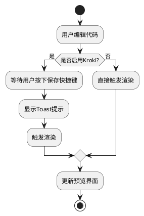
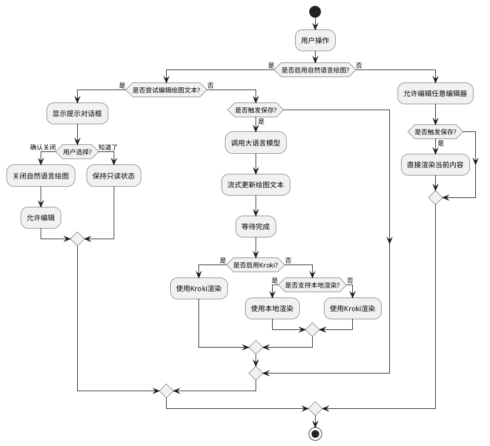

# KIRO 在线绘图工具 - 需求与技术方案文档

## 目录
1. [功能需求](#功能需求)
2. [技术方案](#技术方案)
   - [已实现功能](#已实现功能)
     - [快捷键保存与渲染优化](#快捷键保存与渲染优化)
     - [界面优化与自然语言绘图增强](#界面优化与自然语言绘图增强)
   - [待实现功能](#待实现功能)

## 功能需求

### 1. 快捷键保存与渲染优化

#### 1.1 需求描述
- **问题背景**：在使用 Kroki 渲染时，每次编辑器内容变化都会触发渲染请求，造成不必要的服务器负载
- **目标**：优化渲染触发机制，提升用户体验和系统性能
- **具体需求**：
  1. 当开启 Kroki 渲染时，编辑器内容变化不应立即触发渲染
  2. 通过快捷键（Mac: Command+S, Windows: Ctrl+S）触发保存和渲染
  3. 渲染时显示 toast 提示，告知用户保存和渲染状态
  4. 关闭 Kroki 渲染时保持原有的实时渲染行为

#### 1.2 验收标准
1. 开启 Kroki 渲染时：
   - 编辑内容不会触发自动渲染
   - 使用快捷键可以触发渲染
   - 触发渲染时显示 toast 提示
2. 关闭 Kroki 渲染时：
   - 保持实时渲染功能
   - 编辑内容自动触发渲染更新

### 2. 界面优化与自然语言绘图增强

#### 2.1 需求描述
- **问题背景**：需要优化工具栏布局和编辑器交互，提升自然语言绘图功能的用户体验
- **目标**：简化操作流程，优化用户交互体验
- **具体需求**：
  1. 工具栏优化：
     - 将"启用自然语言绘图"选项从设置弹窗移至工具栏
     - 将刷新图标改为保存图标，实现与快捷键保存相同的功能
  2. 双编辑器支持：
     - 提供自然语言编辑器和绘图文本编辑器
     - 添加编辑器切换按钮
     - 两种编辑器始终保持切换功能，无论是否启用自然语言绘图
  3. 自然语言绘图流程优化：
     - 仅在用户保存时（快捷键或按钮）触发大语言模型调用
     - 流式获取绘图文本并实时更新到绘图文本编辑器
     - 全部内容获取完成后自动渲染
  4. 渲染优先级：
     - 优先使用 Kroki（如果开启）
     - 其次检查本地渲染支持（目前仅 Mermaid）
     - 默认使用 Kroki 渲染
  5. 编辑器权限控制：
     - 启用自然语言绘图时，绘图文本编辑器为只读
     - 用户尝试编辑时弹出提示对话框
     - 提供"确认关闭"和"知道了"两个选项
     - "确认关闭"会关闭自然语言绘图模式
     - "知道了"保持当前状态不变

#### 2.2 验收标准
1. 工具栏改动：
   - 自然语言绘图开关直接显示在工具栏
   - 保存按钮功能正常，提示正确
2. 编辑器功能：
   - 两个编辑器可以正常切换
   - 内容保持同步
   - 切换按钮位置合理，图标清晰
3. 自然语言绘图模式：
   - 保存时正确调用大语言模型
   - 流式响应正确更新到编辑器
   - 完成后自动渲染生效
4. 权限控制：
   - 启用自然语言绘图时绘图文本编辑器确实只读
   - 尝试编辑时弹出提示对话框
   - 两个按钮功能符合预期

## 技术方案

### 1. 快捷键保存与渲染优化

#### 1.1 整体流程


#### 1.2 实现方案
1. **Toast组件实现**
```javascript
// 创建toast提示元素
const toast = document.createElement('div');
toast.style.cssText = `
    position: fixed;
    bottom: 20px;
    right: 20px;
    background-color: rgba(0, 0, 0, 0.8);
    color: white;
    padding: 10px 20px;
    border-radius: 4px;
    display: none;
    z-index: 1000;
    transition: opacity 0.3s ease-in-out;
`;

// Toast显示函数
function showToast(message, duration = 2000) {
    toast.textContent = message;
    toast.style.display = 'block';
    toast.style.opacity = '1';
    
    setTimeout(() => {
        toast.style.opacity = '0';
        setTimeout(() => {
            toast.style.display = 'none';
        }, 300);
    }, duration);
}
```

2. **快捷键监听实现**
```javascript
// 添加全局快捷键监听
document.addEventListener('keydown', function(e) {
    // 检查是否按下了Command+S (Mac) 或 Ctrl+S (Windows/Linux)
    if ((e.metaKey || e.ctrlKey) && e.key === 's') {
        e.preventDefault(); // 阻止浏览器默认的保存行为
        
        // 获取当前是否使用Kroki
        useKroki = document.getElementById('use-kroki').checked;
        
        if (useKroki) {
            showToast('已保存，开始渲染...');
            renderDiagram(true); // 传入true表示强制渲染
        }
    }
});
```

3. **渲染逻辑优化**
```javascript
// 编辑器变更监听
editor.on('change', function() {
    useKroki = document.getElementById('use-kroki').checked;
    if (!useKroki) {
        // 如果不使用Kroki，则实时渲染
        renderDiagram(false);
    }
});

// 渲染函数优化
async function renderDiagram(forceRender = false) {
    if (renderTimeout) {
        clearTimeout(renderTimeout);
    }

    renderTimeout = setTimeout(async () => {
        const code = editor.getValue();
        const previewContainer = document.getElementById('preview-container');
        useKroki = document.getElementById('use-kroki').checked;

        try {
            if (!useKroki || forceRender) {
                DiagramRenderers.render(code, currentDiagramType, previewContainer);
            }
        } catch (error) {
            console.error('渲染错误:', error);
            DiagramRenderers.showError(`渲染失败: ${error.message}`, previewContainer);
        }
    }, 500);
}
```

#### 1.3 关键设计说明
1. **状态管理**
   - 使用 `useKroki` 变量跟踪 Kroki 渲染状态
   - 通过 `forceRender` 参数控制强制渲染行为

2. **性能优化**
   - 使用防抖处理（500ms）避免频繁渲染
   - 条件渲染避免不必要的 Kroki 服务调用

3. **用户体验**
   - Toast 提示使用渐隐动画效果
   - 保存快捷键符合用户习惯
   - 错误处理和提示完善

#### 1.4 注意事项
1. 确保 toast 提示不会遮挡重要的界面元素
2. 快捷键冲突处理（阻止浏览器默认行为）
3. 错误处理和用户提示完善

### 2. 界面优化与自然语言绘图增强

#### 2.1 整体流程


#### 2.2 实现方案
1. **配置文件更新**
```javascript
// config.js
const config = {
    // ... existing code ...
    
    // 本地渲染支持配置
    localRenderSupport: {
        mermaid: true,
        plantuml: false,
        // ... 其他图表类型
    },
    
    // 编辑器配置
    editor: {
        switchIcon: 'fas fa-exchange-alt',
        saveIcon: 'fas fa-save',
        readOnlyMessage: {
            title: '编辑器已锁定',
            content: '当前处于自然语言绘图模式，绘图文本编辑器为只读状态。是否需要关闭自然语言绘图？',
            confirmText: '确认关闭',
            cancelText: '知道了'
        }
    }
};
```

2. **工具栏改造**
```html
<!-- index.html 工具栏部分 -->
<div class="tools">
    <div class="diagram-type">
        <!-- ... existing code ... -->
    </div>
    <div class="nl-drawing">
        <input type="checkbox" id="enable-nl-drawing" />
        <label for="enable-nl-drawing">启用自然语言绘图</label>
    </div>
    <div class="save">
        <button id="save-btn" class="save-icon" title="保存">
            <i class="fas fa-save"></i>
        </button>
    </div>
    <!-- ... existing code ... -->
</div>
```

3. **编辑器切换实现**
```javascript
// main.js
function initEditors() {
    // 创建两个编辑器实例
    const textArea = document.getElementById('code-editor');
    const nlTextArea = document.createElement('textarea');
    nlTextArea.id = 'nl-editor';
    textArea.parentNode.appendChild(nlTextArea);
    
    // 创建编辑器实例
    diagramEditor = CodeMirror.fromTextArea(textArea, {
        // ... 编辑器配置
    });
    
    nlEditor = CodeMirror.fromTextArea(nlTextArea, {
        // ... 编辑器配置
    });
    
    // 创建切换按钮
    const switchBtn = document.createElement('button');
    switchBtn.className = 'editor-switch';
    switchBtn.innerHTML = `<i class="${config.editor.switchIcon}"></i>`;
    textArea.parentNode.appendChild(switchBtn);
    
    // 初始隐藏自然语言编辑器
    nlEditor.getWrapperElement().style.display = 'none';
    
    // 绑定切换事件
    switchBtn.addEventListener('click', toggleEditor);
}

function toggleEditor() {
    const diagramWrapper = diagramEditor.getWrapperElement();
    const nlWrapper = nlEditor.getWrapperElement();
    
    if (diagramWrapper.style.display !== 'none') {
        diagramWrapper.style.display = 'none';
        nlWrapper.style.display = '';
    } else {
        diagramWrapper.style.display = '';
        nlWrapper.style.display = 'none';
    }
}

// 编辑器权限控制
function setupEditorPermissions() {
    diagramEditor.on('beforeChange', function(cm, change) {
        if (document.getElementById('enable-nl-drawing').checked) {
            showReadOnlyDialog();
            return false; // 阻止编辑
        }
    });
}

function showReadOnlyDialog() {
    const { title, content, confirmText, cancelText } = config.editor.readOnlyMessage;
    
    const dialog = document.createElement('div');
    dialog.className = 'modal';
    dialog.innerHTML = `
        <div class="modal-content">
            <h3>${title}</h3>
            <p>${content}</p>
            <div class="modal-footer">
                <button class="confirm">${confirmText}</button>
                <button class="cancel">${cancelText}</button>
            </div>
        </div>
    `;
    
    document.body.appendChild(dialog);
    
    dialog.querySelector('.confirm').addEventListener('click', () => {
        document.getElementById('enable-nl-drawing').checked = false;
        dialog.remove();
    });
    
    dialog.querySelector('.cancel').addEventListener('click', () => {
        dialog.remove();
    });
}
```

4. **渲染流程优化**
```javascript
async function handleSave() {
    const useNLDrawing = document.getElementById('enable-nl-drawing').checked;
    const useKroki = document.getElementById('use-kroki').checked;
    
    if (useNLDrawing) {
        // 获取自然语言内容
        const nlContent = nlEditor.getValue();
        
        try {
            // 调用大语言模型API
            const response = await fetch('/api/nl-draw', {
                // ... API调用配置
            });
            
            // 处理流式响应
            const reader = response.body.getReader();
            let accumulatedCode = '';
            
            while (true) {
                const {value, done} = await reader.read();
                if (done) break;
                
                // 更新绘图文本编辑器
                const chunk = new TextDecoder().decode(value);
                accumulatedCode += chunk;
                diagramEditor.setValue(accumulatedCode);
            }
            
            // 完成后渲染
            renderDiagram(true);
        } catch (error) {
            showToast('生成失败: ' + error.message);
        }
    } else {
        // 直接渲染当前编辑器内容
        renderDiagram(true);
    }
}

function renderDiagram(forceRender = false) {
    const code = diagramEditor.getValue();
    const type = document.getElementById('diagram-select').value;
    const useKroki = document.getElementById('use-kroki').checked;
    
    if (useKroki || !config.localRenderSupport[type]) {
        // 使用Kroki渲染
        DiagramRenderers.renderWithKroki(code, type);
    } else {
        // 使用本地渲染
        DiagramRenderers.render(code, type);
    }
}
```

#### 2.3 关键设计说明
1. **编辑器管理**
   - 使用两个独立的 CodeMirror 实例
   - 通过 CSS display 属性控制切换
   - 保持各自的编辑历史和状态

2. **权限控制**
   - 使用 CodeMirror 的 beforeChange 事件拦截编辑
   - 模态对话框提供清晰的用户选择
   - 状态切换即时生效

3. **渲染优化**
   - 配置驱动的渲染决策
   - 流式响应处理
   - 错误处理和提示

4. **用户体验**
   - 清晰的视觉反馈
   - 一致的交互模式
   - 直观的状态提示

#### 2.4 注意事项
1. 确保编辑器切换时不丢失内容
2. 处理好自然语言绘图模式切换时的状态同步
3. 优化流式响应的更新频率，避免过于频繁的重渲染
4. 提供清晰的错误提示和状态反馈
5. 注意模态对话框的层级管理
